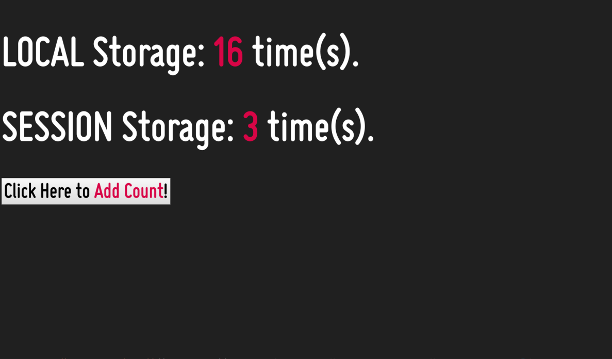

# Web Storage

In general, web storage is a web app development method and protocol used for storing data in a web browser. The web
storage supports persistent data storage, and it is similar to cookies, but with a significantly enhanced capacity and
no information stored in the HTTP request header. There are two main web storage types: local storage and session
storage, behaving similarly to persistent cookies and session cookies, respectively.

Because webOS TV supports the web storage function, it also offers two different storage areas: local storage and
session storage. Those storage methods differ in scope and lifetime.

## Local Storage

Any web apps can store their data locally with local storage in webOS TV. You can also store your data in your local web
browser and webOS TV emulator too. In the previous storing method, app data had to be stored in cookies, included in
every server request. However, with current HTML standards, the local storage is more secure, and large amounts of data
can be stored locally, without affecting website performance.

Unlike cookies, the storage limit is far larger (at least 5 MB), and the information is never transferred to the server.
Note that the data in local storage can be deleted by the "Initial setting" menu (factory reset). Using a remote server
is recommended to keep your data. The data can also be deleted depending on the following app types and conditions.

- Packaged app: The data is deleted when users update or remove your app on webOS TV.
- [Hosted app](https://webostv.developer.lge.com/develop/getting-started/web-app-types#hosted-web-app): The data is deleted when the total usage of data reaches the limit.

Note that since version 3.5 of webOS TV, the local storage size is limited to 16MB.

To simplify the process of local storage, we just added the clickcount() method to present and check the local storage
as below code, and after taking the clickcount value, it shows the counted number of local storage.

```javascript
// Check Local Storage
if (localStorage.clickcount) {
  localStorage.clickcount = Number(localStorage.clickcount) + 1;
} else {
  localStorage.clickcount = 1;
}

// Retrieve Local Storage
document.getElementById("resultLocal").innerHTML =
  "LOCAL Storage: " + localStorage.clickcount + " time(s).";
```

## Session Storage

Unlike the local storage saves its value persistently, the session storage keeps its value on the browser only for the
duration of the session. In the view of the app lifetime, it maintains a storage area that is available for the duration
of the page session. For the webOS TV, you can see your stored values are cleared if you turn off your app after using
the session storage in your app.

Also, to check and retrieve the session storage, we added the clickcount() method in the below code. The following
example counts the number of times a user has clicked a button, in the current session:

```javascript
// Check Session Storage
if (sessionStorage.clickcount) {
  sessionStorage.clickcount = Number(sessionStorage.clickcount) + 1;
} else {
  sessionStorage.clickcount = 1;
}

// Retrieve Session Storage
document.getElementById("resultSession").innerHTML =
  "SESSION Storage: " + sessionStorage.clickcount + " time(s).";
```

## Result in the webOS TV

You can launch and see the sample app result in the webOS TV as below image.



## Do’s and Don’ts

- **Do** test this sample app on your webOS TV.
- **Do** exit your app in the webOS TV and check how the value is changed.
